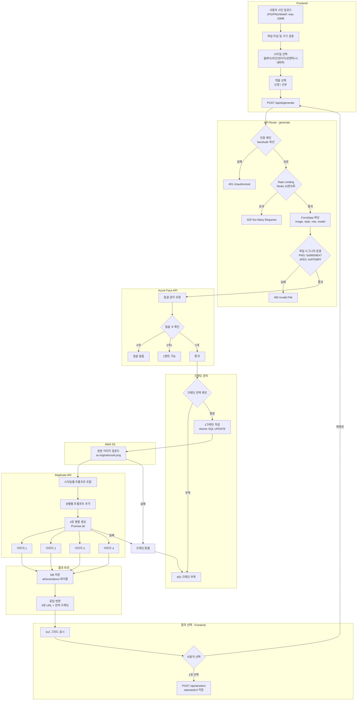

# AI 사진 생성 프로세스 Flow

## 관련 파일

| 영역 | 파일 |
|------|------|
| API 메인 | `app/api/ai/generate/route.ts` |
| 얼굴 감지 | `lib/ai/face-detection.ts` |
| AI 생성 | `lib/ai/replicate.ts` |
| 크레딧 | `lib/ai/credits.ts` |
| Rate Limit | `lib/ai/rate-limit.ts` |
| S3 업로드 | `lib/ai/s3.ts` |
| 모델 정의 | `lib/ai/models.ts` |
| 상수/설정 | `lib/ai/constants.ts` |
| 프론트 메인 | `app/dashboard/ai-photos/page.tsx` |
| 업로더 | `app/dashboard/ai-photos/components/AIPhotoUploader.tsx` |
| 스타일 선택 | `app/dashboard/ai-photos/components/StyleSelector.tsx` |
| 결과 갤러리 | `app/dashboard/ai-photos/components/ResultGallery.tsx` |
