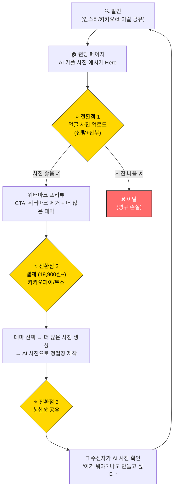
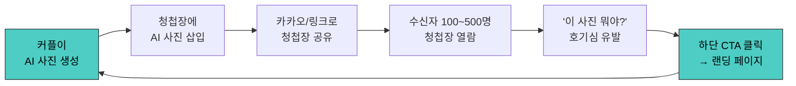
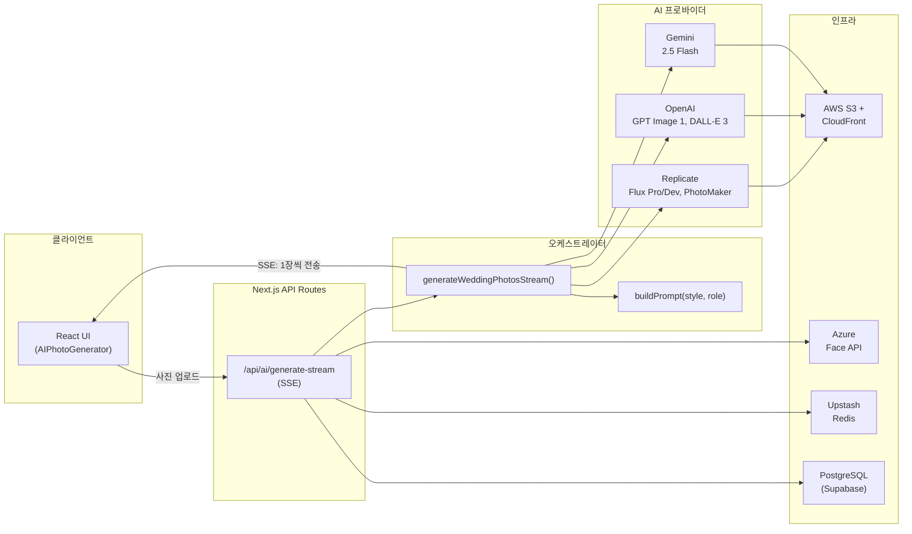
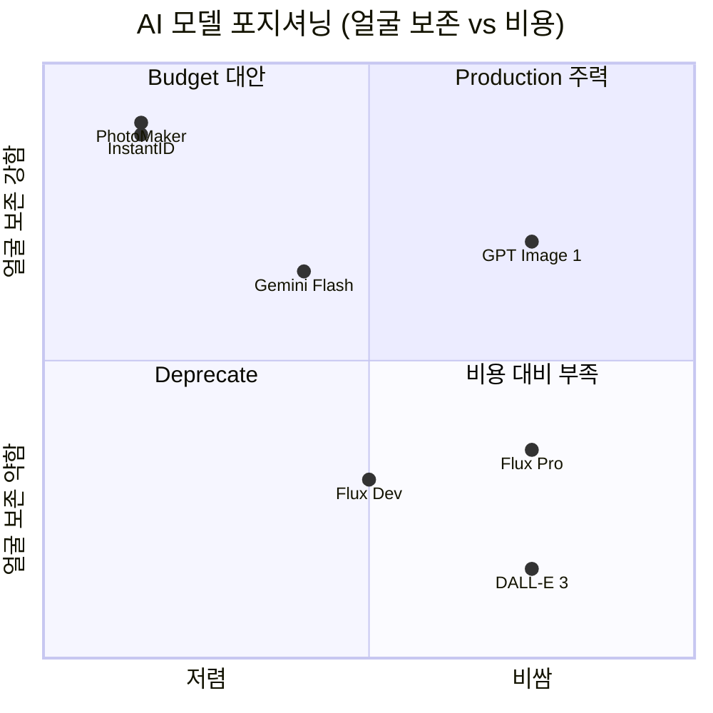
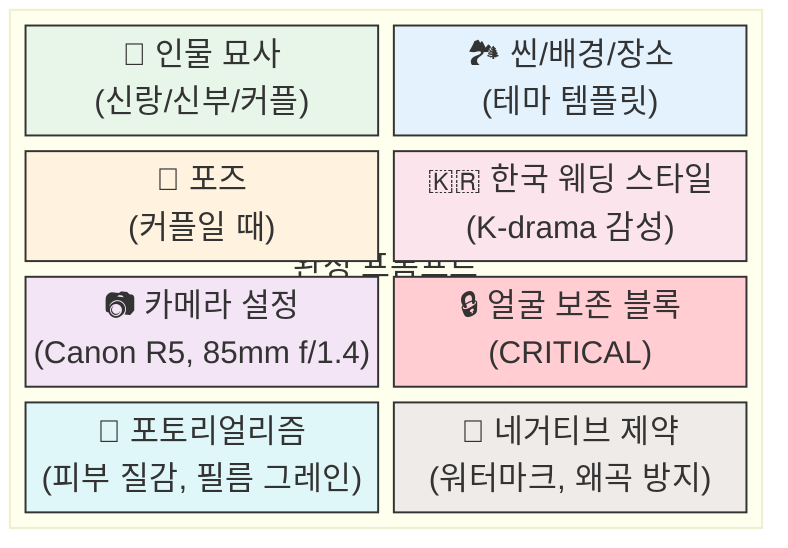
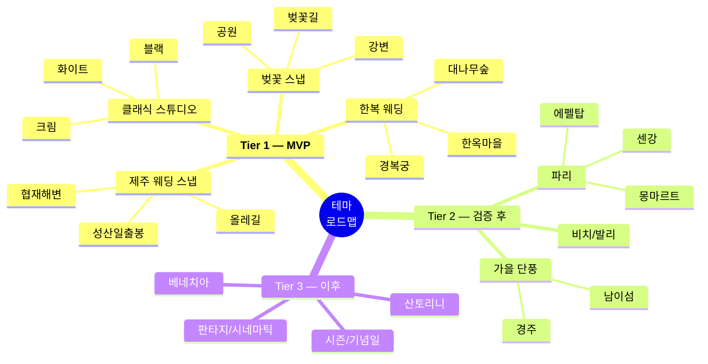
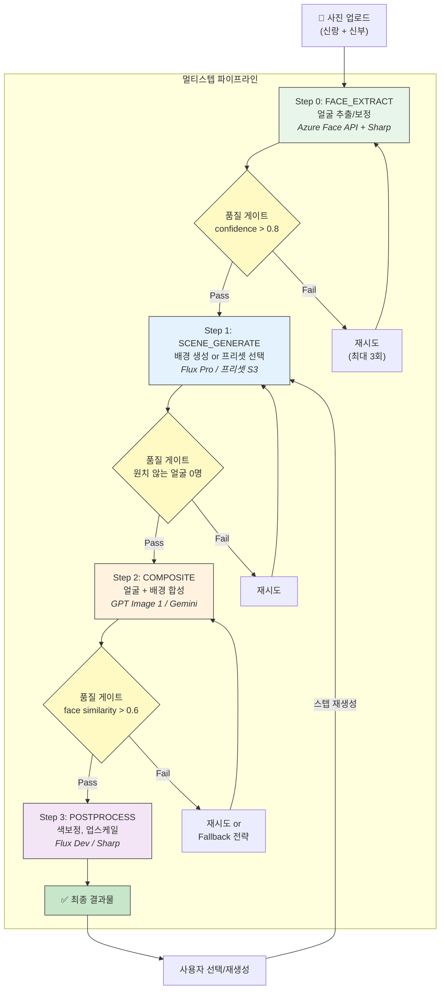
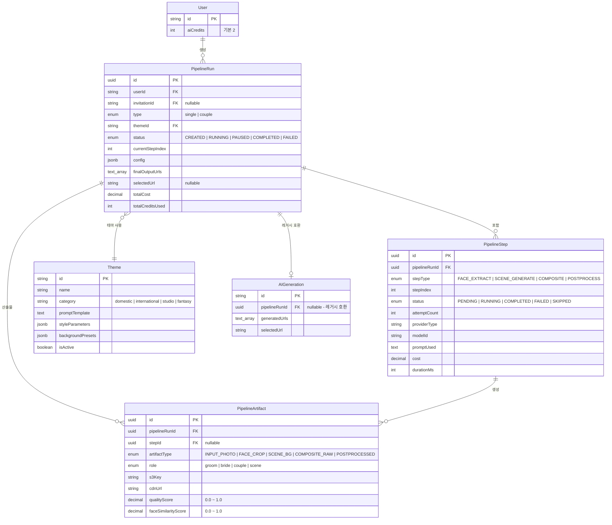
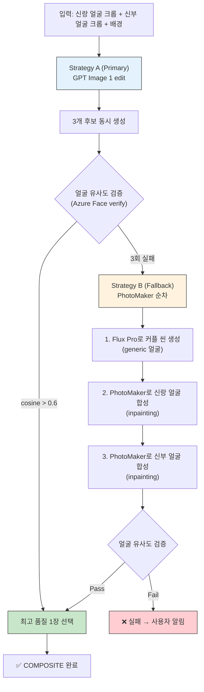
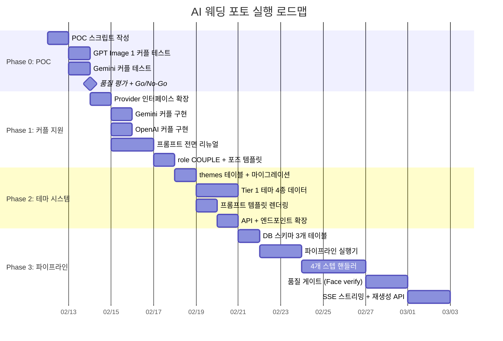

# AI 웨딩 포토 생성 시스템 — 기획서

> Cuggu AI Wedding Photo Generation System
> 작성일: 2026-02-11

---

## 1. 개요

### 1-1. 배경

Cuggu는 한국 시장 타겟 모바일 청첩장 플랫폼이다.
AI 웨딩 사진 생성이 핵심 차별화 포인트이며, 현재 단일 인물(신랑 OR 신부) 사진에
10가지 스타일을 적용해 4장 배치로 생성하는 시스템이 구현되어 있다.

### 1-2. 목표

- **커플 사진 합성**: 두 사람(신랑+신부) 사진을 받아 함께 찍은 것처럼 생성
- **테마/촬영지 기반**: 제주, 파리, 베네치아 등 실제 웨딩 촬영 장소 컨셉
- **멀티스텝 파이프라인**: 한 번에 완벽할 필요 없이, 여러 과정을 거쳐 초고품질 달성
- **실제 판매 가능한 품질**: 결혼을 준비하는 커플에게 실제로 팔 수 있는 수준

### 1-3. 제약 조건

- 비용은 우선 고려하지 않음 (품질 최우선)
- 1인 운영 가능한 복잡도 유지
- 기존 시스템과 하위 호환

---

## 2. 시장 분석

### 2-1. 시장 규모

- 한국 연간 결혼 커플: ~20만 쌍
- 모바일 청첩장 사용률: 70%+ → 타겟 시장 약 14만 커플/년
- 웨딩 사진 스튜디오 시장: 1조원+ (커플당 200~500만원)
- AI 프로필 시장 검증 완료: 2023년 Snow/Meitu AI 프로필 붐으로 한국 소비자의 AI 사진 결제 의향 확인

### 2-2. 경쟁 환경

| 플레이어 | 서비스 | 갭 |
|---------|--------|-----|
| 바른/보이스카드/청첩장만들기 | 템플릿 기반 청첩장, 사진 업로드 | AI 생성 없음. 완전 commodity |
| Snow/Meitu | 단일 인물 AI 프로필 | 커플 합성 없음, 웨딩 특화 아님 |
| 드리미/AI웨딩스냅 (신생) | AI 웨딩 사진 단독 판매 | 청첩장과 번들 아님. 별도 구매 마찰 |
| Canva/미리캔버스 | 디자인 도구 | 범용. AI 얼굴 합성 없음 |

**핵심 차별화**: 모바일 청첩장 + AI 커플 웨딩 사진을 결합한 경쟁자 없음

### 2-3. 수익 추정

- 전환율 10%, 평균 객단가 30,000원 가정
- 연 매출: 14만 x 10% x 3만원 = **4.2억원** (AI 단독)
- 청첩장 번들링으로 객단가 상향 시: 연 10~20억원 TAR

---

## 3. 제품 전략

### 3-1. 포지셔닝

> **"우리 둘만의 드림 웨딩 스냅 — AI가 만드는 꿈의 웨딩 앨범"**

- 실제 촬영 "대체"가 아님 → 스튜디오가 **못하는 것**을 AI로
- 웨딩 촬영 전 미리보기 (preview)
- 해외 촬영 느낌의 보충 앨범 (supplementary)
- 청첩장 메인 사진 (hero image)
- "cheap alternative"가 아닌 "dream experience"

### 3-2. 가격 전략

| 티어 | 가격 | 구성 |
|------|------|------|
| Free | 0원 | AI 커플 사진 1장 (워터마크), 기본 청첩장 |
| Starter | 19,900원 | 청첩장 + AI 커플 사진 4장 (1 테마), 워터마크 제거 |
| Premium | 39,900원 | 청첩장 + AI 커플 사진 12장 (3 테마), 프리미엄 템플릿 |
| Album | 69,900원 | 청첩장 + AI 커플 사진 30장 (전체 테마), 앨범 다운로드 |

- 구독 모델 아님 (결혼은 일회성 이벤트)
- 청첩장과 번들 판매 (AI 사진 단독 판매 아님)
- 무료 워터마크 사진이 핵심 전환 도구

### 3-3. 사용자 여정 & 전환 포인트



### 3-4. 바이럴 루프



청첩장 공유 = 자연 광고. 모든 수신자가 잠재 고객.
AI 사진은 "이거 어떻게 만든 거야?"라는 호기심을 유발하는 훅.

### 3-5. 리스크 평가

| 리스크 | 심각도 | 대응 |
|--------|--------|------|
| **얼굴 왜곡/언캐니밸리** | Critical | 멀티스텝, 얼굴 검증, 재생성 옵션 |
| **커플 합성 품질** | Critical | Phase 0에서 선행 검증. 안 되면 제품 재설계 |
| **기대치 vs 현실 괴리** | High | "AI 아트" 명확히 프레이밍, 예시 미리 표시 |
| **생성 원가** | Medium | 높은 가격대로 흡수, 파이프라인 최적화 |
| **초상권/동의** | Medium | 양측 명시적 동의 체크박스, 약관 정비 |
| **경쟁자 모방** | Low | 선점자 우위 + 청첩장 번들 방어벽 6~12개월 |

---

## 4. 현재 시스템 분석

### 4-1. 아키텍처



**현재 플로우**: 사진 1장 업로드 → `buildPrompt(style, role)` → `provider.generateImage()` → S3 → 4장 반환

### 4-2. 파일 구조

```
lib/ai/
├── generate.ts              # 오케스트레이터 (동기 + 스트리밍)
├── models.ts                # AIModel 정의 (6개 모델)
├── prompts.ts               # 10 스타일 프롬프트 + buildPrompt()
├── providers/
│   ├── types.ts             # GenerationProvider 인터페이스
│   ├── index.ts             # getProvider() 라우터
│   ├── openai.ts            # GPT Image 1 (edit), DALL-E 3 (generate)
│   ├── gemini.ts            # Gemini 2.5 Flash (generateContent)
│   └── replicate.ts         # Flux Pro/Dev, PhotoMaker
├── face-detection.ts        # Azure Face API (사전 검증)
├── s3.ts                    # S3 업로드/복사
├── credits.ts               # 크레딧 관리
├── rate-limit.ts            # Rate limiting
├── validation.ts            # 이미지 검증
├── constants.ts             # 설정값
├── env.ts                   # 환경변수
└── logger.ts                # 구조화된 로깅

app/api/ai/
├── generate/route.ts        # POST (동기)
├── generate-stream/route.ts # SSE 스트리밍
├── generations/route.ts     # GET 히스토리
├── select/route.ts          # POST 사진 선택
└── models/route.ts          # GET 모델 목록
```

### 4-3. 현재 모델 현황

| 모델 | 프로바이더 | 얼굴 보존 | 비용/장 | 참조 이미지 |
|------|-----------|----------|---------|-----------|
| Flux 1.1 Pro | Replicate | Fair | $0.04 | O |
| Flux Dev | Replicate | Fair | $0.025 | O |
| PhotoMaker | Replicate | Excellent | $0.0095 | O |
| GPT Image 1 | OpenAI | Good | $0.04 | O (edit) |
| DALL-E 3 | OpenAI | Poor | $0.04 | X |
| Gemini 2.5 Flash | Google | Good | $0.02 | O |

주석 처리됨: InstantID (Excellent, $0.0095), SDXL FaceID (Excellent, $0.005)

### 4-4. 핵심 제약

- `GenerationProvider.generateImage()`가 단일 이미지(`imageUrl`) 1개만 입력받음
- 커플(2인) 합성을 하려면 인터페이스 확장 필요
- 프롬프트가 너무 단순: "handsome Korean groom" + 스타일 설명 1줄
- 얼굴 보존 지시가 부실: "keeping the exact same face" 한 줄
- 포토리얼리즘/한국 웨딩 스타일 특성 미반영

---

## 5. AI 모델 전략

### 5-1. 프로바이더 우선순위



**Tier 1 (Production — 주력)**
- **GPT Image 1** (OpenAI): 최고 품질, 얼굴 보존 Good, edit 모드로 참조 이미지 지원
  - `input_fidelity: 'high'` 파라미터 사용 가능 여부 확인 필요
  - GPT Image 1.5 출시 여부 확인 필요 (리서치에서 언급됨)
- **Gemini 2.5 Flash** (Google): 커플 사진 최적 (네이티브 멀티 이미지 퓨전), 가성비 최고

**Tier 2 (Fallback/Budget)**
- **PhotoMaker V2** (Replicate): 단일 인물 얼굴 보존 Excellent, 최저가
- **InstantID** (Replicate): 재활성화 검토, 단일 인물 얼굴 보존 Excellent

**Tier 3 (Deprecate)**
- Flux Pro/Dev: 얼굴 보존 Fair — 웨딩 사진에 부적합
- DALL-E 3: 참조 이미지 미지원 — 사용 의미 없음

### 5-2. 커플 사진 모델 매칭

| 접근법 | 모델 | 장점 | 단점 |
|--------|------|------|------|
| **Gemini 멀티이미지 퓨전** | Gemini 2.5 Flash | 네이티브 2인 지원, 저렴 | 품질 변동 |
| **GPT Image edit** | GPT Image 1 | 최고 품질 | 2인 동시 지원 검증 필요 |
| **순차 합성** | PhotoMaker + Inpainting | 얼굴 최강 | 3번 호출, 이음새 발생 |
| **Generate + FaceSwap** | Flux Pro + face-swap | 배경 품질 최고 | 2단계 복잡도 |

### 5-3. 스텝별 최적 모델 (멀티스텝 파이프라인)

| 스텝 | Primary | Fallback | 근거 |
|------|---------|----------|------|
| 얼굴 추출 | Azure Face API + Sharp | - | 감지+크롭 |
| 배경 생성 | Flux Pro (Replicate) | DALL-E 3 | 포토리얼 씬 최고 |
| 합성 | GPT Image 1 (edit) | Gemini 2.5 Flash | 멀티 참조 이미지 |
| 후처리 | Flux Dev (img2img) | Sharp (로컬) | 업스케일/색보정 |

---

## 6. 프롬프트 엔지니어링 전략

### 6-1. 현재 프롬프트 문제점

```
현재:
"handsome Korean groom in elegant black tuxedo and bow tie,
 Transform the scene into a classic, elegant studio wedding portrait..."

문제:
- 인물 묘사가 1줄로 너무 짧음
- 얼굴 보존 지시가 프롬프트 끝에 한 줄 ("keeping the exact same face")
- 포토리얼리즘 지시 없음 (AI 느낌 나는 결과물)
- 한국 웨딩 사진 특유의 스타일 미반영
- 네거티브 프롬프트 미사용 (Replicate 제외)
- 카메라/렌즈 설정 미지정
```

### 6-2. 새 프롬프트 구조



### 6-3. 핵심 프롬프트 블록

#### 얼굴 보존 블록 (모든 프롬프트 필수)

```
FACE PRESERVATION (CRITICAL - DO NOT IGNORE):
- Preserve the person's face from the reference image with 100% accuracy
- Keep identical: facial bone structure, eye shape, nose shape, lip shape, jawline, chin
- Keep identical: skin tone, skin texture with natural pores, moles, and subtle imperfections
- Keep identical: eyebrow shape and thickness, ear shape
- Maintain natural facial proportions - no stretching, no smoothing, no beautification
- The person must be immediately recognizable as the same individual
```

#### 한국 웨딩 스타일 블록

```
Professional Korean wedding photography style (한국 웨딩 사진):
- Soft, dreamy, romantic atmosphere with natural elegance
- Shot like a professional Korean wedding studio (스튜디오 원규, 안정우 스타일)
- Warm but natural color grading, similar to Kodak Portra 400 film
- Soft diffused lighting, no harsh shadows
- Clean composition with couple as clear focal point
- Natural, relaxed poses as if captured in an authentic moment
- Shallow depth of field with creamy bokeh background
- Subtle warm tone overall color temperature (5200-5600K)
- Natural skin rendering with soft glow, no heavy retouching look
- White, cream, and pastel tones in wardrobe and environment
- The image should evoke the feeling of a Korean drama romantic scene
```

#### 포토리얼리즘 블록

```
PHOTOREALISM REQUIREMENTS:
- This must look like a real photograph taken by a professional photographer
- Include natural skin texture: visible pores, subtle skin imperfections, natural moles
- Natural eye reflections with visible catchlights
- Realistic fabric texture: visible thread patterns, natural wrinkles and folds
- Natural hair texture: individual strands visible, natural shine and volume
- Realistic depth of field with natural bokeh
- Subtle film grain reminiscent of Kodak Portra 400
- Natural color science: no oversaturated or HDR look
- The image should feel honest, candid, and unposed even in posed shots
```

#### 네거티브 제약 블록

```
ABSOLUTE EXCLUSIONS:
- No watermarks, text, logos, signatures, or overlaid graphics
- No extra fingers, missing fingers, fused fingers, malformed hands
- No deformed face, asymmetrical face, crossed eyes, dead eyes
- No plastic skin, waxy skin, poreless airbrushed skin
- No uncanny valley effect, mannequin look, doll-like appearance
- No cartoon, anime, illustration, painting, drawing, or sketch style
- No 3D render, CGI, digital art look
- No blurry, low resolution, jpeg artifacts, or compression artifacts
- No extra limbs, missing limbs, floating body parts
- No visible seams, edge artifacts, green screen look, composite errors
```

### 6-4. 인물 묘사

```
신랑:
"A handsome Korean groom wearing an elegant tailored dark navy tuxedo with satin lapels,
 crisp white dress shirt, and silk bow tie. Well-groomed hair, confident yet gentle expression."

신부:
"A beautiful Korean bride wearing an elegant white wedding gown with delicate lace details
 and a flowing cathedral-length veil. Natural nude-tone makeup, soft wavy hair with minimal
 accessories, radiant gentle smile."

커플:
"A Korean wedding couple. The groom (Image 1) wears an elegant tailored dark navy tuxedo.
 The bride (Image 2) wears an elegant white wedding gown with delicate lace details.
 Both have warm, natural expressions."
```

### 6-5. 커플 포즈 템플릿

| 포즈 | 프롬프트 |
|------|---------|
| 손잡기 | standing side by side, holding hands gently, both looking at the camera with warm natural smiles |
| 서로 바라보기 | facing each other slightly, gazing into each other's eyes with gentle smiles, foreheads almost touching |
| 백허그 | groom standing behind bride, arms wrapped gently around her waist, bride's hand resting on his arm |
| 이마 키스 | groom gently kissing bride's forehead, bride closing eyes with serene smile, intimate moment |
| 함께 걷기 | walking hand in hand along the path, candid mid-stride, laughing naturally together |
| 어깨 기대기 | seated close together, bride leaning her head on groom's shoulder, peaceful moment |
| 볼 맞대기 | standing close, cheeks touching, both smiling at camera, natural and warm |
| 업기 | groom giving bride a playful piggyback ride, both laughing joyfully, candid and fun |

### 6-6. 프로바이더별 프롬프트 최적화

#### OpenAI (GPT Image 1)
- 사진 언어 사용 (렌즈, 조명, 프레이밍) — 아트/일러스트 언어 금지
- 카메라 지정: "Shot on Canon EOS R5 with 85mm f/1.4 lens"
- 질감 요청: "visible pores, natural skin texture, subtle imperfections"
- 얼굴 포함 이미지를 **첫 번째**로 배치 (첫 5장이 높은 fidelity)
- 편집 시: "Change only X" + "Keep everything else the same"

#### Gemini (2.5 Flash)
- 이미지를 **프롬프트 앞에** 배치
- 캐릭터 정의를 명확히 반복: "Image 1 shows the groom. Image 2 shows the bride."
- 캐릭터 드리프트 방지: "keep the same person" 반복
- 변경은 단계적으로 (iterative prompts)

#### Replicate (PhotoMaker)
- 트리거 워드 `img` 필수: "A photo of a img person as..."
- `style_strength_ratio` 낮출수록 얼굴 보존 강화 (10~20 권장)
- `num_steps` 높일수록 품질 향상 (25~35 권장)
- negative_prompt 파라미터 활용

### 6-7. 한국 웨딩 사진 색감 프리셋

| 프리셋 | 설명 |
|--------|------|
| Classic Warm | Warm pastel, lifted shadows, desaturated reds, creamy highlights, Kodak Portra 400 |
| Bright Airy | High key, white/cream dominant, minimal contrast, soft ethereal glow |
| Film Nostalgic | Warm amber, gentle vignette, visible grain, faded blacks, vintage warmth |
| Natural Clean | Accurate skin tones, minimal post-processing, true-to-life with slight warmth |
| Sunset Romantic | Golden hour warmth, amber/peach tones, lens flare, warm shadows |

---

## 7. 테마/촬영지 시스템

### 7-1. 테마 우선순위



#### Tier 1 — MVP 런치 (4종)

| 테마 | 카테고리 | 서브 로케이션 | 선정 근거 |
|------|---------|-------------|----------|
| **제주 웨딩 스냅** | 국내 | 올레길, 협재해변, 성산일출봉, 한라산 | 국내 1위 웨딩 촬영지 |
| **클래식 스튜디오** | 스튜디오 | 화이트, 크림, 블랙 배경 | 가장 보편적 청첩장 사진 |
| **한복 웨딩** | 국내 | 경복궁, 한옥마을, 대나무숲 | 트렌드 상승, 한국 차별화 |
| **벚꽃 스냅** | 국내 | 벚꽃길, 공원, 강변 | 감성적, 시즌 무관 "꿈" 컨텐츠 |

#### Tier 2 — 검증 후 확장

- 파리 (에펠탑, 센강, 몽마르트, 샹젤리제)
- 가을 단풍 (남이섬, 경주)
- 비치/발리 (트로피컬)

#### Tier 3 — 이후

- 베네치아, 산토리니
- 시즌/기념일 테마
- 판타지/시네마틱

### 7-2. 테마별 프롬프트 템플릿 (예시)

#### 제주 해변

```
A beautiful Korean couple standing on Hyeopjae Beach in Jeju Island,
crystal clear emerald water, Biyangdo island visible in the distance,
gentle waves lapping at their feet, {{poseDescription}},
{{timeOfDay}} light, {{season}} atmosphere,
professional Korean wedding photography,
shot on Canon EOS R5 with 85mm f/1.2 lens,
shallow depth of field, warm golden skin tones
```

스타일 파라미터:
- lighting: golden hour
- colorPalette: emerald green water, white sand, warm golden
- mood: serene, romantic, tropical paradise

#### 파리 에펠탑

```
Standing on Trocadero terrace with the Eiffel Tower perfectly framed behind them,
Champ de Mars gardens visible, Parisian rooftops in the distance,
early morning with few people, {{poseDescription}},
soft dawn light, warm pink-golden glow on the Eiffel Tower,
shot on Canon EOS R5 with 50mm f/1.2 lens,
shallow depth of field, classic Parisian romance
```

#### 경복궁 한복

```
Standing in the courtyard of Gyeongbokgung Palace,
Geunjeongjeon main hall visible behind,
traditional Dancheong painted wooden columns,
elaborate traditional Korean wedding Hanbok,
bride in green jeogori and red chima with gold embroidery,
groom in dark blue durumagi,
{{poseDescription}}, clear autumn afternoon,
shot on Canon EOS R5 with 50mm f/1.2 lens
```

### 7-3. 데이터 모델

```ts
themes = pgTable('themes', {
  id: text('id').primaryKey(),              // 'jeju-beach'
  name: text('name').notNull(),             // '제주 해변'
  nameEn: text('name_en').notNull(),
  category: text('category').notNull(),     // domestic | international | studio | fantasy
  description: text('description').notNull(),
  thumbnailUrl: text('thumbnail_url').notNull(),
  promptTemplate: text('prompt_template').notNull(),
  negativePrompt: text('negative_prompt').default(''),
  styleParameters: jsonb('style_parameters').default({}),
  backgroundPresets: jsonb('background_presets').default([]),
  compositeGuidance: jsonb('composite_guidance').default({}),
  isActive: boolean('is_active').default(true),
  sortOrder: integer('sort_order').default(0),
  createdAt: timestamp('created_at').defaultNow(),
});
```

---

## 8. 기술 아키텍처

### 8-1. Phase 1: 커플 지원 (현재 아키텍처 확장)

#### Provider 인터페이스 확장

```ts
// lib/ai/providers/types.ts
export interface GenerationProvider {
  readonly providerType: ProviderType;
  generateImage(params: {
    prompt: string;
    imageUrl: string;
    imageUrls?: string[];       // NEW: 커플용 복수 이미지
    modelConfig: AIModel;
    variationIndex: number;
    negativePrompt?: string;    // NEW: 네거티브 프롬프트
  }): Promise<ImageOutput>;
}
```

#### Gemini 커플 구현

```ts
// 2개 inlineData로 커플 프롬프트 생성
const parts = [
  { inlineData: { mimeType: 'image/png', data: groomBase64 } },  // Image 1
  { inlineData: { mimeType: 'image/png', data: brideBase64 } },  // Image 2
  { text: couplePrompt }  // "Image 1 shows the groom. Image 2 shows the bride..."
];
```

#### OpenAI 커플 구현

```ts
// 복수 이미지 파일 → images.edit()
const response = await openai.images.edit({
  model: 'gpt-image-1',
  image: [groomFile, brideFile],
  prompt: couplePrompt,
  size: '1024x1536',
});
```

### 8-2. Phase 3: 멀티스텝 파이프라인

#### 파이프라인 구조



각 스텝 결과를 사용자에게 보여주고, 마음에 안 드는 스텝만 재생성 가능.

#### DB 스키마



#### 파이프라인 실행기

```ts
// lib/ai/pipeline/executor.ts
async function executePipeline(runId: string, callbacks: SSECallbacks) {
  const steps = await getSteps(runId);

  for (const step of steps) {
    if (step.status === 'COMPLETED') continue;

    const handler = getStepHandler(step.stepType);
    const result = await handler.execute(run, step, callbacks);

    // 품질 게이트
    if (!await handler.qualityCheck(result)) {
      if (step.attemptCount < MAX_RETRIES) {
        await retryStep(step);
        continue;
      }
      // PAUSED → 사용자 판단
      return;
    }
  }
}
```

#### 커플 합성 전략



#### 품질 게이트

| 스텝 | 검증 항목 | 기준 |
|------|----------|------|
| FACE_EXTRACT | 얼굴 감지 confidence | > 0.80 |
| FACE_EXTRACT | 인물 수 | 정확히 1명 |
| SCENE_GENERATE | 원치 않는 얼굴 | 0명 |
| COMPOSITE | 얼굴 유사도 (vs 원본) | cosine > 0.6 |
| COMPOSITE | 인물 수 | 커플: 2명, 단일: 1명 |
| POSTPROCESS | 해상도 | >= 입력 해상도 |

#### API 엔드포인트

```
POST   /api/ai/pipeline              # 파이프라인 생성
GET    /api/ai/pipeline/{id}          # 상태 조회
GET    /api/ai/pipeline/{id}/stream   # SSE 스트리밍 실행
POST   /api/ai/pipeline/{id}/steps/{n}/retry  # 스텝 재생성
POST   /api/ai/pipeline/{id}/select   # 최종 사진 선택
GET    /api/ai/themes                 # 테마 목록
```

### 8-3. 비용 추정

#### 단일 생성 (현재)
```
Flux Dev × 4장 = $0.10
GPT Image 1 × 4장 = $0.16
Gemini Flash × 4장 = $0.08
```

#### 멀티스텝 파이프라인 (Phase 3)
```
얼굴 감지:  ~$0.004  (Azure Face API)
배경 생성:  ~$0.15   (Flux Pro × 3후보)
합성:      ~$0.24   (GPT Image 1 × 3후보)
후처리:    ~$0.03   (Flux Dev)
검증:      ~$0.006  (Azure Face verify)
───────────────────────
합계:      ~$0.43 (정상) ~ $0.60 (재시도 포함)
```

가격 19,900원 기준 → 원가 $0.60 = ~900원 → 마진 95%+

---

## 9. 파일 변경 요약

### 수정하는 기존 파일

| 파일 | 변경 내용 | Phase |
|------|----------|-------|
| `lib/ai/providers/types.ts` | imageUrls[], negativePrompt 추가 | 1 |
| `lib/ai/providers/openai.ts` | 복수 이미지, input_fidelity | 1 |
| `lib/ai/providers/gemini.ts` | 복수 inlineData | 1 |
| `lib/ai/prompts.ts` | 프롬프트 전면 리뉴얼 | 1 |
| `lib/ai/generate.ts` | role: COUPLE, imageUrls | 1 |
| `lib/ai/models.ts` | 모델 업데이트, InstantID 재활성화 검토 | 1 |
| `lib/ai/face-detection.ts` | Azure Face verify 추가 | 3 |
| `db/schema.ts` | themes, pipeline 테이블들 | 2, 3 |
| API routes | themeId, COUPLE 지원 | 1, 2 |

### 새로 만드는 파일

| 파일 | 역할 | Phase |
|------|------|-------|
| `scripts/poc-couple.ts` | POC 테스트 스크립트 | 0 |
| `lib/ai/themes/registry.ts` | 테마 시드 데이터 | 2 |
| `lib/ai/themes/prompt-builder.ts` | 템플릿 렌더링 | 2 |
| `lib/ai/pipeline/executor.ts` | 파이프라인 실행기 | 3 |
| `lib/ai/pipeline/types.ts` | 스텝 핸들러 인터페이스 | 3 |
| `lib/ai/pipeline/quality.ts` | 품질 스코어링 | 3 |
| `lib/ai/pipeline/steps/*.ts` | 4개 스텝 핸들러 | 3 |
| `schemas/pipeline.ts` | Zod 스키마 | 3 |
| `types/pipeline.ts` | TypeScript 타입 | 3 |
| `app/api/ai/themes/route.ts` | 테마 API | 2 |
| `app/api/ai/pipeline/**` | 파이프라인 API | 3 |

---

## 10. 실행 로드맵



### Phase 0: POC — 커플 합성 품질 검증

> **Gate**: 이게 안 되면 나머지 전부 재설계

- `scripts/poc-couple.ts` 작성
- GPT Image 1 + Gemini 2.5 Flash로 커플 웨딩 사진 생성 테스트
- 개선된 프롬프트 (얼굴 보존 + 포토리얼리즘 블록) 적용
- 결과: 샘플 이미지 + 품질 평가 → Go/No-Go 결정

### Phase 1: 커플 지원 + 프롬프트 개선

- Provider 인터페이스 확장 (imageUrls[], negativePrompt)
- Gemini/OpenAI 커플 구현
- 프롬프트 전면 리뉴얼 (구조화된 블록 시스템)
- role: 'COUPLE' 추가
- 커플 포즈 템플릿

### Phase 2: 테마 시스템

- themes DB 테이블 + 마이그레이션
- Tier 1 테마 4종 시드 데이터
- 프롬프트 템플릿 렌더링 (`{{placeholder}}` 치환)
- API + 기존 엔드포인트 확장 (themeId 파라미터)

### Phase 3: 멀티스텝 파이프라인

- DB 스키마 3개 테이블 (pipelineRuns, pipelineSteps, pipelineArtifacts)
- 파이프라인 실행기 + 4개 스텝 핸들러
- 품질 게이트 (Azure Face verify)
- SSE 스트리밍 + 스텝 재생성 API

---

## 11. 열린 질문

| # | 질문 | 영향 범위 |
|---|------|----------|
| 1 | 파이프라인당 최종 사진 몇 장? (3후보 중 자동 1장 vs 다 보여주기) | UI, API |
| 2 | 스텝별 중간 결과를 사용자에게 보여줄지? | UX, 스트리밍 |
| 3 | 테마별 차등 가격? 프리미엄 테마? | 과금, DB |
| 4 | 배경 프리셋을 직접 촬영/구매할지, AI 생성할지? | 콘텐츠, 비용 |
| 5 | GPT Image 1.5 실제 사용 가능 여부 | 모델 전략 |

---

## 참고 자료

### OpenAI / GPT Image
- GPT Image Prompting Guide (OpenAI Cookbook)
- Generate Images with High Input Fidelity (OpenAI Cookbook)
- Image Generation Guide (OpenAI API Docs)

### Gemini
- Gemini 2.5 Flash Image (Google Developers Blog)
- How to Prompt Gemini Image Generation (Google Developers Blog)

### Face Preservation
- PhotoMaker V2 (TencentARC/GitHub)
- InstantID (Official)
- IP-Adapter FaceID comparison

### Korean Wedding Photography
- Korean Style Wedding Photography reference
- Korean Pre-Wedding Photography trends
