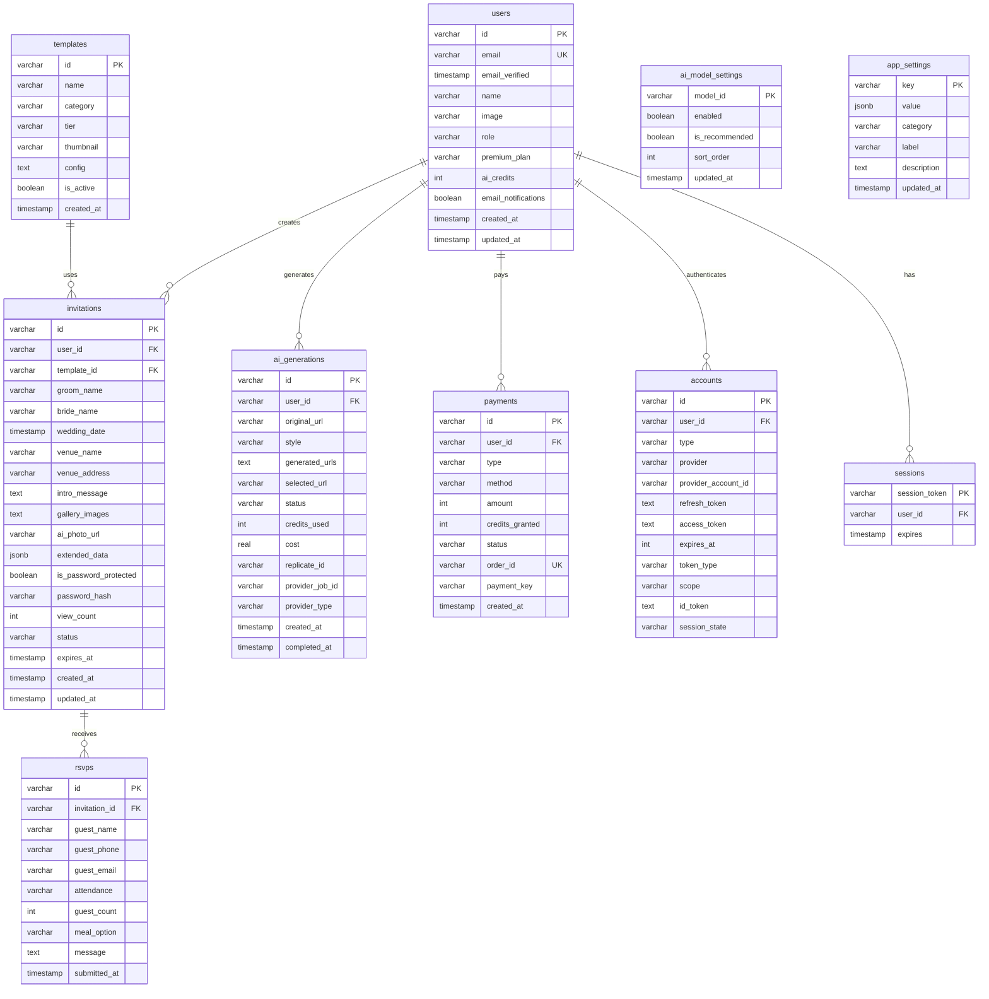

# Cuggu Database ERD (Mermaid)

> 렌더링: GitHub `.md`, VSCode Mermaid 확장, [mermaid.live](https://mermaid.live)
> Mermaid 10+ 권장

## 관계 요약

| 관계 | 카디널리티 | onDelete |
|------|-----------|----------|
| users → invitations | 1:N | CASCADE |
| users → ai_generations | 1:N | CASCADE |
| users → payments | 1:N | CASCADE |
| users → accounts | 1:N | CASCADE |
| users → sessions | 1:N | CASCADE |
| templates → invitations | 1:N | - |
| invitations → rsvps | 1:N | CASCADE |

`ai_model_settings`, `app_settings`는 독립 테이블 (FK 없음)
