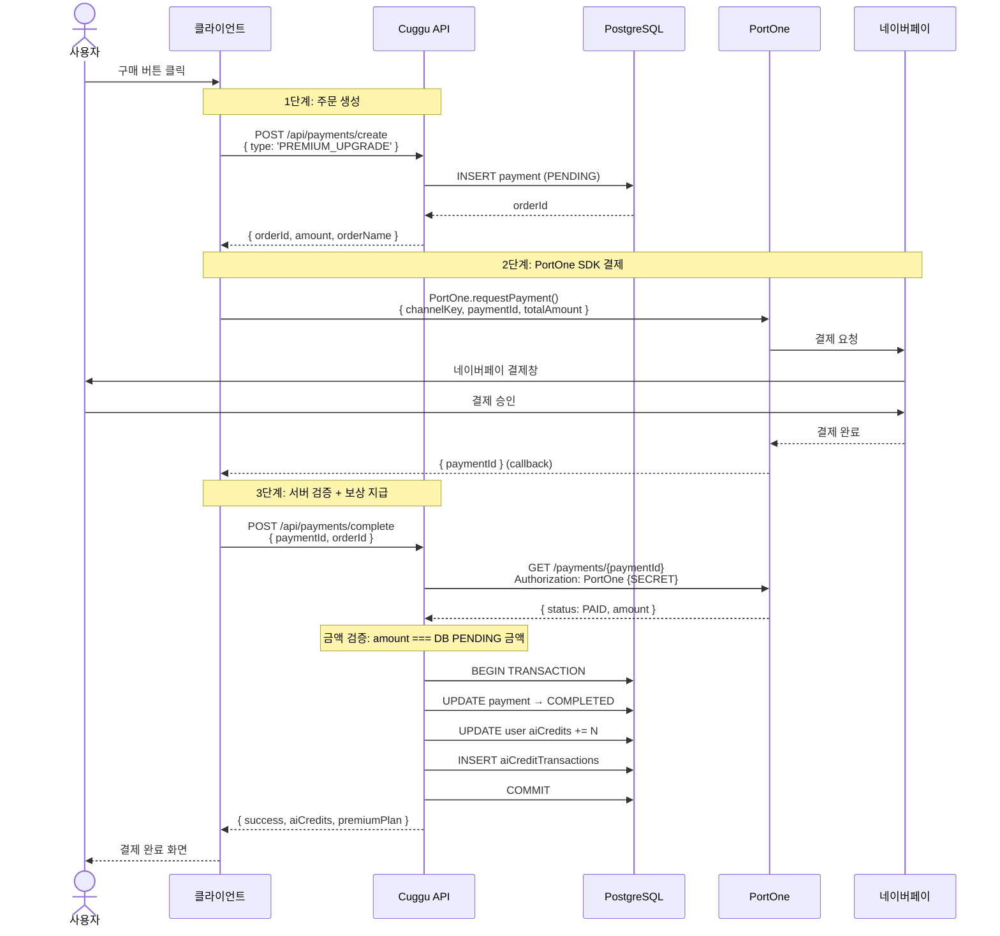
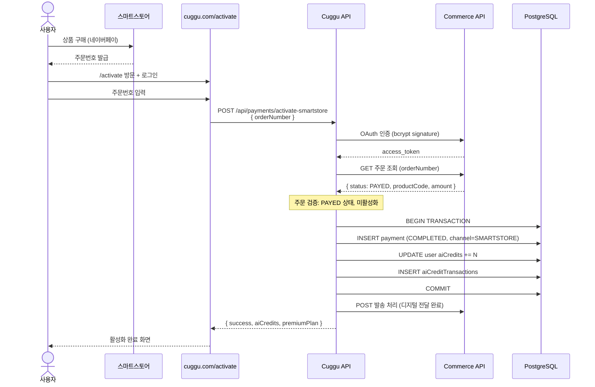

# 결제 플로우 설계: PortOne V2 + 네이버페이 + 스마트스토어

> **작성일**: 2026-02-13
> **우선순위**: P0 (MVP 출시 필수)
> **대체**: `docs/payment-system-plan.md` (Toss 기반 — 폐기)

---

## 배경

기존 Toss Payments 직접 연동 계획을 **PortOne V2** (PG aggregator) + **네이버페이**로 변경.
동시에 **네이버 스마트스토어**에도 상품을 올려 네이버 검색 유입 → 구매 → 서비스 활성화 경로 확보.

**왜 PortOne?**
- PG 직접 연동 대비 심사/계약 간소화 (PortOne이 대행)
- 네이버페이 우선, 나중에 카드/카카오페이 추가는 채널키만 바꾸면 됨
- V2 SDK: `PortOne.requestPayment()` → 서버에서 조회/검증 — Toss보다 단순한 플로우

**두 채널:**
| | 자사 사이트 (PortOne) | 스마트스토어 |
|---|---|---|
| 결제 | PortOne SDK → 네이버페이 | 스마트스토어에서 네이버가 처리 |
| 서비스 활성화 | 즉시 (서버 검증 후) | 사용자가 `/activate`에서 주문번호 입력 |
| 사용자 매핑 | 로그인 세션 | 로그인 + 주문번호로 Commerce API 검증 |

---

## 1. 상품 구성 (변경 없음)

| 상품 | 금액 (KRW) | 보상 |
|------|-----------|------|
| 프리미엄 업그레이드 | 9,900원 | premiumPlan=PREMIUM + 10크레딧 |
| AI 크레딧 1회 | 1,000원 | 1크레딧 |
| AI 크레딧 10회 패키지 | 8,000원 | 10크레딧 (20% 할인) |

---

## 2. DB 스키마 변경

### `db/schema.ts`

```diff
- export const paymentMethodEnum = pgEnum('payment_method', [
-   'TOSS',
-   'KAKAO_PAY',
-   'CARD',
- ]);
+ export const paymentMethodEnum = pgEnum('payment_method', [
+   'NAVER_PAY',
+   'KAKAO_PAY',
+   'CARD',
+ ]);

+ export const paymentChannelEnum = pgEnum('payment_channel', [
+   'SITE',         // 자사 사이트 (PortOne)
+   'SMARTSTORE',   // 네이버 스마트스토어
+ ]);
```

**payments 테이블:**
```diff
  export const payments = pgTable('payments', {
    ...
-   paymentKey: varchar('payment_key', { length: 255 }),
+   paymentId: varchar('payment_id', { length: 255 }),  // PortOne paymentId or SmartStore orderId
+   channel: paymentChannelEnum('channel').default('SITE').notNull(),
    ...
  });
```

→ Drizzle 마이그레이션 필요 (enum 값 변경 + 컬럼 rename/add)

---

## 3. 자사 사이트 결제 플로우 (PortOne V2)

### 시퀀스 다이어그램



### Toss 대비 차이점
- Toss: create → SDK → redirect → **confirm (서버→Toss API 승인)** → grant
- PortOne V2: create → SDK → callback → **complete (서버→PortOne API 조회만)** → grant
- PortOne이 PG 승인을 대행하므로, 우리는 결과 조회/검증만 하면 됨

---

## 4. 스마트스토어 연동 플로우

### 사전 준비 (수동)
1. 스마트스토어 센터에서 상품 3개 등록 (디지털 콘텐츠, 배송 없음)
2. 상품 설명에 "구매 후 cuggu.com/activate 에서 활성화" 안내 문구
3. 커머스 API 애플리케이션 등록 → Client ID/Secret 발급

### 활성화 시퀀스



### Commerce API 인증
- OAuth 2.0 Client Credentials
- Signature: `bcrypt(clientId_timestamp, clientSecret)` → base64
- Access token 유효기간 내 캐싱 (Redis or 메모리)

---

## 5. 파일 변경 목록

### 신규 생성 (11개)

| 파일 | 역할 |
|------|------|
| `lib/payments/portone.ts` | PortOne V2 API 클라이언트 (결제 조회/검증) |
| `lib/payments/grant.ts` | 보상 지급 로직 (atomic transaction) — `lib/ai/credits.ts` 패턴 재사용 |
| `lib/payments/smartstore.ts` | 스마트스토어 Commerce API 클라이언트 |
| `app/api/payments/create/route.ts` | 주문 생성 API (PENDING 레코드) |
| `app/api/payments/complete/route.ts` | PortOne 결제 검증 + 보상 지급 |
| `app/api/payments/activate-smartstore/route.ts` | 스마트스토어 주문 검증 + 보상 지급 |
| `app/payments/success/page.tsx` | 결제 성공 페이지 |
| `app/payments/fail/page.tsx` | 결제 실패 페이지 |
| `app/payments/layout.tsx` | 결제 페이지 레이아웃 |
| `app/activate/page.tsx` | 스마트스토어 활성화 페이지 |
| `components/payments/CheckoutButton.tsx` | PortOne SDK 결제 버튼 |

### 수정 (7개)

| 파일 | 변경 내용 |
|------|-----------|
| `db/schema.ts` | paymentMethodEnum 수정, paymentChannelEnum 추가, payments 컬럼 변경 |
| `schemas/payment.ts` | Toss 스키마 제거 → PortOne 스키마, method enum 업데이트 |
| `app/api/payments/history/route.ts` | method 라벨 (TOSS→NAVER_PAY), channel 표시 |
| `app/api/admin/payments/route.ts` | 라벨 + channel 필터 |
| `components/admin/PaymentTable.tsx` | methodLabels, channel 컬럼 |
| `app/dashboard/settings/page.tsx` | 버튼 → CheckoutButton 연결 |
| `components/editor/tabs/TemplateTab.tsx` | 업그레이드 버튼 → CheckoutButton |

### 삭제
- `docs/payment-system-plan.md` — Toss 설계 (이 문서로 대체)

---

## 6. 핵심 구현 상세

### `lib/payments/portone.ts`
```typescript
const PORTONE_API_SECRET = process.env.PORTONE_API_SECRET!;

export async function verifyPayment(paymentId: string) {
  const res = await fetch(
    `https://api.portone.io/payments/${encodeURIComponent(paymentId)}`,
    { headers: { Authorization: `PortOne ${PORTONE_API_SECRET}` } }
  );
  if (!res.ok) throw new Error('PortOne payment verification failed');
  return PortOnePaymentResponseSchema.parse(await res.json());
}
```

### `lib/payments/grant.ts`
```typescript
// lib/ai/credits.ts의 atomic increment 패턴 재사용
export async function grantPaymentRewards(
  userId: string, paymentId: string, paymentType: PaymentType,
  externalPaymentId: string, channel: 'SITE' | 'SMARTSTORE'
) {
  await db.transaction(async (tx) => {
    // 1. payment 상태 PENDING 재확인 (이중 지급 방지) — SITE만
    //    SMARTSTORE는 INSERT + 이미 처리 체크로 대체
    // 2. payment → COMPLETED, paymentId 저장
    // 3. user.aiCredits += N (sql`${users.aiCredits} + ${credits}`)
    // 4. PREMIUM_UPGRADE면 premiumPlan = 'PREMIUM'
    // 5. aiCreditTransactions INSERT (type: 'PURCHASE', referenceType: 'PAYMENT')
  });
}
```

### `components/payments/CheckoutButton.tsx`
```typescript
// PortOne V2 SDK: next/script로 lazyOnload
// Props: { paymentType: PaymentType, children, className?, disabled? }
// 클릭 → POST /api/payments/create → PortOne.requestPayment()
// 네이버페이 bypass: { naverpay: { useCfmYmdt, productItems: [...] } }
```

### `lib/payments/smartstore.ts`
```typescript
// OAuth 2.0 인증 (bcrypt signature)
// getAccessToken(): 토큰 캐싱 (메모리 or Redis)
// verifyOrder(orderNumber: string): 주문 조회 + PAYED 확인
// getProductOrderDetail(productOrderId): 상품 주문 상세
// dispatchOrder(productOrderId): 발송 처리
// mapProductToPaymentType(productCode): 상품코드 → PaymentType
```

---

## 7. 환경변수

```env
# PortOne V2
NEXT_PUBLIC_PORTONE_STORE_ID=""     # 브라우저 SDK 초기화
PORTONE_API_SECRET=""                # 서버 전용 (결제 조회)

# 네이버페이 채널키 (PortOne 콘솔에서 발급)
NEXT_PUBLIC_PORTONE_CHANNEL_KEY=""   # 브라우저에서 channelKey로 사용

# 스마트스토어 Commerce API
NAVER_COMMERCE_CLIENT_ID=""
NAVER_COMMERCE_CLIENT_SECRET=""      # bcrypt salt
```

---

## 8. 보안

| 위협 | 대응 |
|------|------|
| 클라이언트 금액 변조 | complete 시 PortOne 조회 금액 vs DB PENDING 금액 비교 |
| 이중 지급 | status=PENDING 조건 + 트랜잭션 내 재확인 |
| API Secret 노출 | PORTONE_API_SECRET 서버 전용, NEXT_PUBLIC_ 아님 |
| 스마트스토어 위조 주문 | Commerce API 직접 조회로 검증 (외부 webhook 아님) |
| Stale PENDING | 추후 cron cleanup 추가 |

---

## 9. 구현 순서

### Phase 1: 자사 사이트 결제 (핵심)
1. DB 마이그레이션 (enum 변경 + 컬럼 추가)
2. `schemas/payment.ts` 리팩터 (Toss → PortOne)
3. `lib/payments/portone.ts` + `grant.ts`
4. API routes: `create` + `complete`
5. `app/payments/` 페이지 (success, fail, layout)
6. `CheckoutButton` 컴포넌트
7. 기존 버튼 3곳 연결 (settings, TemplateTab, DashboardNav)
8. 기존 API/어드민 라벨 업데이트

### Phase 2: 스마트스토어 연동
9. `lib/payments/smartstore.ts` (Commerce API 클라이언트)
10. `app/api/payments/activate-smartstore/route.ts` (주문 검증 API)
11. `app/activate/page.tsx` (활성화 페이지 UI)
12. 스마트스토어 센터에서 상품 등록 (수동)

### 별도 작업 (의존성 아님, 병렬 가능)
- 네이버 로그인 추가 (NextAuth provider) — 현재 카카오만 있음

---

## 10. 검증

### 자사 사이트
1. PortOne 테스트 모드로 전체 플로우 (생성 → 결제 → 검증 → 보상)
2. 3개 상품 각각 테스트
3. 이중 지급 방지: 같은 paymentId로 complete 2회 → 409
4. 금액 변조: PortOne 금액 !== DB 금액 → 400
5. 크레딧/프리미엄 전환 확인

### 스마트스토어
6. Commerce API 인증 토큰 발급 테스트
7. 활성화 페이지에서 주문번호 입력 → 검증 → 보상 지급 확인
8. 존재하지 않는/미결제 주문번호 → 에러 메시지
9. 이미 활성화된 주문번호 재입력 → 409
10. 발송 처리 API 호출 확인

---

## 참고

- [PortOne V2 SDK 문서](https://developers.portone.io)
- [PortOne 네이버페이 결제형](https://developers.portone.io/opi/ko/integration/pg/v2/naverpay)
- [네이버 커머스 API](https://github.com/commerce-api-naver/commerce-api)
- 기존 크레딧 시스템: `lib/ai/credits.ts` (atomic increment 패턴)
- 기존 결제 스키마: `schemas/payment.ts`, `db/schema.ts`
